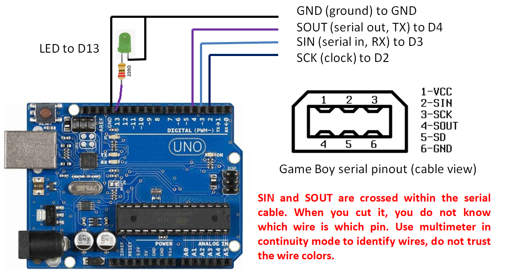
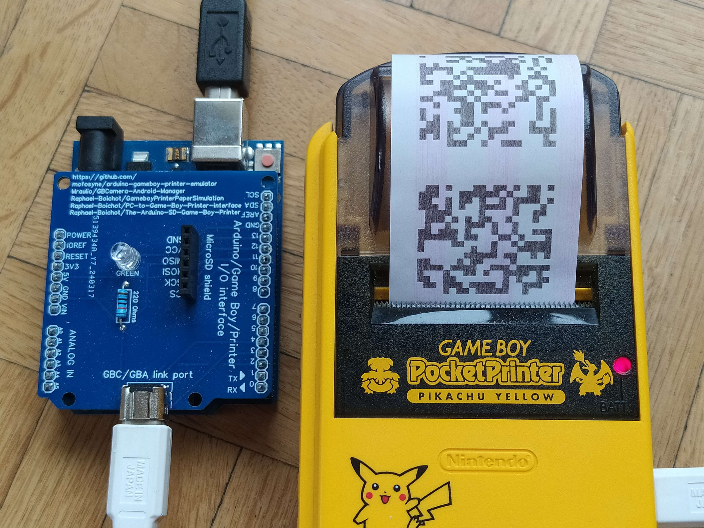

# Yet another PC to Game Boy Printer interface

This project is designed to make sending data to the Game Boy Printer as simple as possible from any platform / OS. The Arduino handles everything at low level — checksums, timing, errors, and formatting — so you only have to send two very simple types of packets over the serial to print. A multi OS example code is provided, but any high level programming language can be used to control the Arduino.

This code derives from a [version using an SD shield](https://github.com/Raphael-Boichot/The-Arduino-SD-Game-Boy-Printer) for the Arduino core and from a [direct PC to printer version](https://github.com/Raphael-Boichot/PC-to-Game-Boy-Printer-interface) for the GNU Octave interface. It is basically a fusion of the two projects.

You can directly use the Arduino core with the [gb-printer-web](https://herrzatacke.github.io/gb-printer-web/webusb/) made by [HerrZatacke](https://github.com/HerrZatacke), it is compatible !

## Printing Procedure (yes it is that simple)

- The Arduino automatically connects to the printer and initializes it. Wait for the "Printer connected" message from the serial port before sending data. The initialization remains valid for at least 10 seconds. All data are exchanged at 250000 bauds.

- To send data, use the following packet format:
**["D"][640-byte [Gameboy 2BPP graphics data](https://www.huderlem.com/demos/gameboy2bpp.html)][CR]** (total of 642 bytes, CR is char(13), "D" keyword for data).
Wait for the outgoing "Printer ready" message on the serial before sending the next packet. Each packet remains valid for only 150 milliseconds if not followed immediately by another one. You can send up to 9 packets consecutively. The same timing rule applies to the print command.

- To print, send the following command:
**["P"][margin][palette][intensity][CR]** (total of 5 bytes, CR is char(13), "P" keyword for print). Margin, palette and intensity are the same as the [Game Boy printing protocol](https://gbdev.gg8.se/wiki/articles/Gameboy_Printer).
Wait for the "Printer ready" message to confirm that printing is complete and it's safe to proceed with other commands.

Additionally the Arduino echoes every packet sent and printer error on the serial so you can debug in case of issue (which is not supposed to happen).

## Installation

The example interface code can be ran with [GNU Octave](https://www.octave.org/) and shows everything you need to print something (a simple 160x144 pixels pattern or a full image). The Arduino core itself can be transfered easily from the [Arduino IDE](https://www.arduino.cc/en/software/).

## Pinout and hardware

The pinout is the same as this [previous project](https://github.com/Raphael-Boichot/PC-to-Game-Boy-Printer-interface). If you want something very neat, you can follow the [instructions given here](https://github.com/Raphael-Boichot/Collection-of-PCB-for-Game-Boy-Printer-Emulators?tab=readme-ov-file) to build a dedicated PCB. This PCB is also compatible with many other related projects so it's a good investment, you won't regret ordering it.

## Troubleshooting

If only white paper is fed or less data than expected shows on paper (typically only the bottom of an image), this means that the delay between packets is to big in your code implementation. You really have to chain packets with less that 150 ms inbetween, this is the only timing to respect. Take inspiration from the example GNU Octave codes.

(Credit: Raphaël BOICHOT)

What you should get with one of the example GNU Octave code : random black and white tiles. Up to you to interface that with any fancier image converter (also provided). The PCB shown on the image (not mandatory) is linked is the previous section.

## Funfact

Dealing with I/O and timing on the serial port — despite the Arduino being a slave-only device — turned out to be a surprisingly frustrating experience. It took me a whole week to get something simple and reliable, which is unusually long for my patience. I hope this project will help people to deal with the printer from the high level programming langage of their own.

## Acknowledgements

- [Andreas Hahn](https://github.com/HerrZatacke) (HerrZatacke) for interfacing the code with the [gb-printer-web](https://herrzatacke.github.io/gb-printer-web/webusb/).
